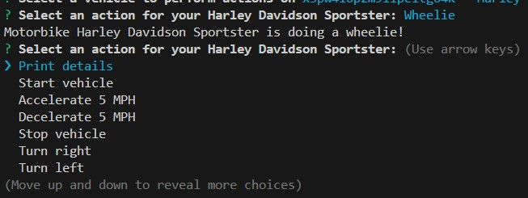

# Vehicle Builder

## Description

The Vehicle Builder is a TypeScript-based command-line application that lets users create and interact with different types of vehicles. Building on an existing codebase, this project adds **Truck** and **Motorbike** classes alongside the original **Car** class. Users can:

- **Create** a new vehicle (Car, Truck, or Motorbike) by entering its specific details  
- **Select** from a list of previously created vehicles  
- **Perform** vehicle-specific actions (e.g., drive, stop, turn, load/unload cargo, pop a wheelie) in a loop until they choose to exit  

All user interaction is handled via the [`inquirer`](https://www.npmjs.com/package/inquirer) package.

---

## Table of Contents

- [Installation](#installation)  
- [Usage](#usage)  
- [Video Walkthrough](#video-walkthrough)  
- [Screenshots](#screenshots)  
- [License](#license)  
- [Contributing](#contributing)  
- [Tests](#tests)  
- [Questions](#questions)  
- [Code Sources](#code-sources)


## Installation

To get started with the Vehicle Builder, clone the repository and install the project dependencies.

1.  Clone the repository:
    ```bash
    git clone git@github.com:LPerez21/TypeScript-and-OOP-Vehicle-Builder.git
    ```
2.  Navigate to the project directory:
    ```bash
    cd [Develop]
    ```
3.  Install dependencies:
    ```bash
    npm install
    ```

## Usage

To run the Vehicle Builder application, execute the following command in your terminal from the project root:

```bash
npm start
```

The application will prompt you to either create a new vehicle or select an existing one. Follow the on-screen instructions to interact with the application.

*   **Create New Vehicle:** Choose this option to create a new Car, Truck, or Motorbike. You will be prompted for relevant details based on your selection.
*   **Select Existing Vehicle:** If you have previously created vehicles, you can choose this option to work with one of them.
*   **Perform Actions:** Once a vehicle is selected, a menu of available actions will be presented. These actions may vary depending on the vehicle type (e.g., a Truck has a unique action like hauling a load).
*   **Exit:** Select this option to close the application.


## Video Walkthrough

https://drive.google.com/file/d/1ffkrGVLdHAJytKfhK8Qpl_JOE2Ty78rY/view?usp=drive_link

## Screenshots

Here’s the application in action:




## License

This project is licensed under the [none].


## Contributing

Contributions are welcome! If you'd like to contribute to the Vehicle Builder, please follow these steps:

[Your contribution guidelines here. For example:
1.  Fork the repository.
2.  Create a new branch for your feature or bug fix.
3.  Implement your changes and ensure they adhere to the project's coding style.
4.  Write descriptive commit messages.
5.  Push your changes to your fork.
6.  Submit a pull request outlining the changes you've made.]

## Tests

To run the project's tests, use the following command:

```bash
[Your test command here, e.g., npm test]
```

[Describe how to run tests and what to expect from the test output.]

## Questions

If you have any questions about this project, feel free to reach out:

*   **GitHub:** [LPerez21](https://github.com/LPerez21)
*   **Email:** [LuisPerez.LP@gmail.com]

## Code Source


Some code snippets for [specific functionality, e.g., handling user input with Inquirer] were adapted from [source, e.g., Stack Overflow thread, peer collaboration with @username]. This code can be found in [file path, e.g., `src/index.ts`].

```
